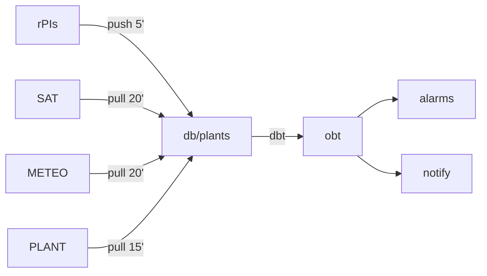

# Overview per a devs

## Estat actual

### Peces

#### repos

[Plantmonitor](https://github.com/Som-Energia/plantmonitor)

Fa d'ORM de les plantes, conté la api i és codi de les raspberrypis. A més a més també té el codi d'ingesta d'apis de tercers.

La meitat del plantmonitor acabarà deprecated pel proveïdor de dades.

[Plant Reader](https://github.com/Som-Energia/somenergia-plant-reader)

Lectura remota de les plantes. Actualment només Asomada es llegeix remotament.

Acabarà deprecated pel proveïdor de dades.

[Jardiner](https://github.com/Som-Energia/somenergia-jardiner)

dbt de les plantes. Actualment tot views.

#### Fonts de dades

- rPIs
- Proveïdor de dades Sateŀlitals (SAT)
- Proveïdor de dades meteorològiques (METEO)
- Proveïdor de dades de plantes (PLANT)
- Proveïdor de preus (Previst) (PRICE)

#### Visualització

- redash
- notificacions novu -> helpscout/notificació
- superset (altres àmbits)

### Esquema




```mermaid
flowchart LR

Pipe de dades bàsic --> s(pick_best_view) --> obt_table --> marts_table
```

## Visió final

