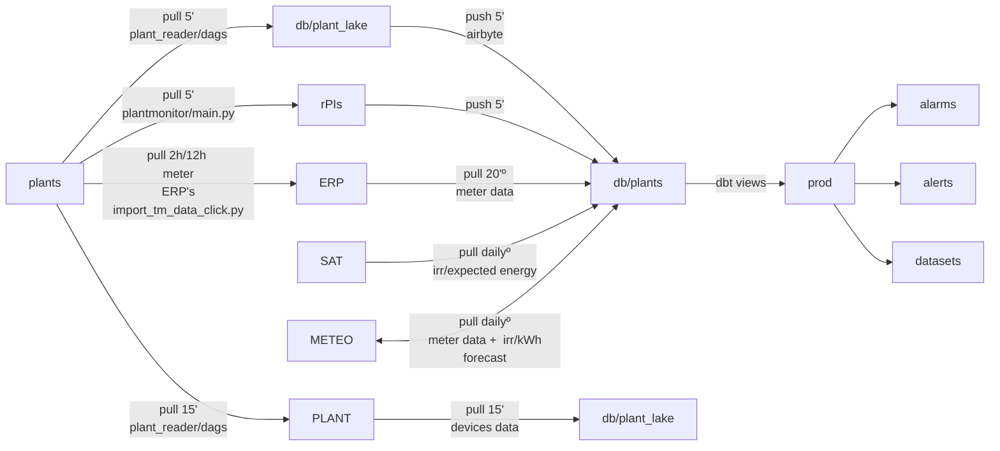
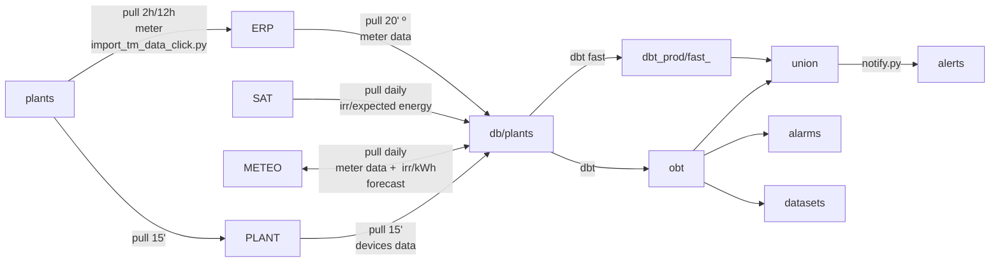

# Overview for devs

## quickstart

To fully deploy the dbt models you can do

```bash
dbt build -s tag:jardiner --store-failures --full-refresh
dbt build -s tag:legacy --store-failures --target prod
```

## Current State of the project

### Pieces

#### repos

[Plantmonitor](https://github.com/Som-Energia/plantmonitor)

Fa d'ORM de les plantes, conté la api i és codi de les raspberrypis. A més a més també té el codi d'ingesta d'apis de tercers.

La meitat del plantmonitor acabarà deprecated pel proveïdor de dades.

[Plant Reader](https://github.com/Som-Energia/somenergia-plant-reader)

Lectura remota de les plantes. Actualment només Asomada es llegeix remotament i es guarda a `plant_lake`.

Acabarà deprecated pel proveïdor de dades.

Actualment també allotja la lectura de la API del proveïdor de dades.

[Jardiner](https://github.com/Som-Energia/somenergia-jardiner)

dbt de les plantes. Actualment tot views.

#### Data sources

- rPIs
- plant_reader
- Irradiation satellite data provider (SAT)
- Meteo forecast provider (METEO)
- Plant data provider (PLANT)
- Price provider (Planned) (PRICE)

#### Visualization

- redash
- novu notifications -> helpscout/mail
- superset (other àmbits of the cooperative)

### Project tructure

#### Actual



º: plantmonitor does it. Update rate defined at conf/startup_configuration.py and each task is run as a function.

#### Planned scheme



Després de l'[ADR d'estructura de pipeline](/somenergia-jardiner/adr/2023-06-13-pipeline_dades_llargues)

See [Roadmap](/somenergia-jardiner/projecte/2023-06-03-macrofase roadmap/)


