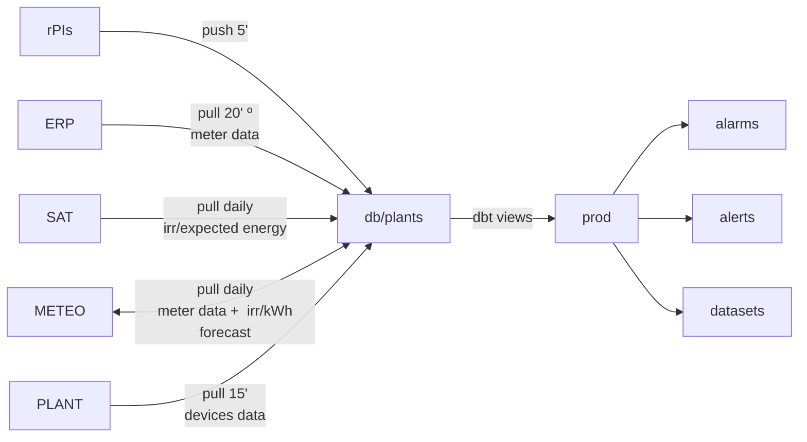

# Macrofase Jardiner 2023

[Roadmap](https://docs.google.com/spreadsheets/d/11dNYUeBwkIjPpcYOHmcOoNDpLoUxH9qfcm6h2YXRtoI/edit#gid=1971023159)

### Roadmap overview

### Flux de dades

## Fita 1

Prioritat 1

Aprox 1-2 fases

Definition of Done (DoD): veure per tema

Cost en mitjos dies de l'equip sencer entre parèntesis (N)

### Dashboard tècnics de plantes crítiques

Pulir el dashboard de tècnics per a Asomada i Llanillos.

DoD: TODO

###	Obtenció de dades de tots els equips i totes les plantes

- [x] Definir estratègia d'obtenció de dades (remot/hardware/api's a plataformes...) (1)
- [x] Coordinació amb altres equips de la cooperativa per veure altres alternatives (6)
- [x] Proves pilot amb algún proveïdor (8)
- [-] Analisi de proveïdors/alternatives i selecció de partner per externalitzar l'obtenció de dades dels  inversors i sondes (2)
- [-] Obtenció de dades tots els comptadors per IP.
    - [ ] Adaptació a frequència quarthoraria. (3)

- [-] Suport a la integració de prova pilot (6)
    - Falta saber com es diferencien les plantes

DoD:
- [ ] Els equips mencionats en el pipe
- [ ] Dset integrat al pipe

### Introducció al jardiner

Estat del codi i repàs de l'estructura. Documentació per devs.

### [DT] OBT i fast-lane

Crear la obt cincminutal incremental i/o el fast-lane cincminutal i la obt diària.

Crear el live per _late arriving facts_ de comptadors i apis.

En funcionament normal són delays de màxim un dia. Amb incidència poden ser 1-2 mesos màxim. I en casos excepcionals, molt més (candidat a full-refresh manual o alguna altra cosa)

### Aterració de tot plegat

- [ ] Intro per devs
    - Més doc?
- [ ] Refer el pipe (fast+slow)
    - Que no tardi 30s
    - DBT standards
- [ ] Dset integrat al pipe
- [ ] Definir el dashboard de tècnics
    - Volem fer servir redash?
    - Parlar amb GA per si volen el Dashboard diferent [al actual]()
    - [ ] Dashboard tecnics Exiom amb Asomada
    - [ ] Dashboard tecnics Exiom amb Llanillos (source original és dset)
- [ ] Deute tècnic Dev
    - CDD
    - Private doc github project

## Fita 2: Dashboard Overview plantes

Prioritat 4

Disseny d'un Dashboard amb un llistat de totes les plantes amb els principals indicadors (mesures en temps real i acumulades i resum alarmes). Pendent fer una proposta per part de GA. Des d'aquest dashboard s'ha de poder accedir al Dashboard de cada planta per obtenir informació detallada.
Esborrany inicial falta versió actualitzada. (6)

Implementació (9)

## Fita 3: Dashboard planta

Prioritat 5

Definir versió revisada del Dashboard de planta per a totes les plantes: Unifilar dinàmic, dades fixes i reemplaçar alarmes, millorar la velociatat i treure el dataset de sota, afegir solargis + coses que puguin sortir després (3)

Implementar versió revisada del Dashboard de planta per a totes les plantes: Unifilar dinàmic, dades fixes i reemplaçar alarmes, millorar la velocitat i treure el dataset de sota, afegir solargis + coses que puguin sortir després (3)

Dashboard Ringsted per plantes -- particularitats (4)

Dashboard Gasdtrup -- particularitats (4)

Dashboard de planta típica (Alcolea, etc) (0)

## Fita 4: Dashboard tècnics

Prioritat 6

Definir la versió final amb grafiques de Solar Gis, Alarmes i pot ser alarmes. Pendent fer una revisió de les funcionalitats per part de GA. Incloure un dashboard per cadascuna de les empreses de manteniment. Al dashboard unificat d'alarmes estat actual afegir des de quan està activada l'alarma

Implementar la versió final amb grafiques de Solar Gis, Alarmes i pot ser alarmes. Pendent fer una revisió de les funcionalitats per part de GA. Incloure un dashboard per cadascuna de les empreses de manteniment

Fer el Dashboard per a 8 empreses instal·ladores. Hauríem de passar a Superset que té una millor gestió d'usuaris?

## Fita 5: Dashboard INECO

Prioritat 7

Per definir

## Fita 6: Noves queries

Prioritat 8

- [ ] Query: Curves HMCIL + lectures comptador (reclamacions)
- [ ] Query: Curves HMCIL + previsió (seguiment)
- [ ] Alarma strings per comparació en plantes grans >1MW

## Fita 7: Dashboard GURB

Prioritat 9